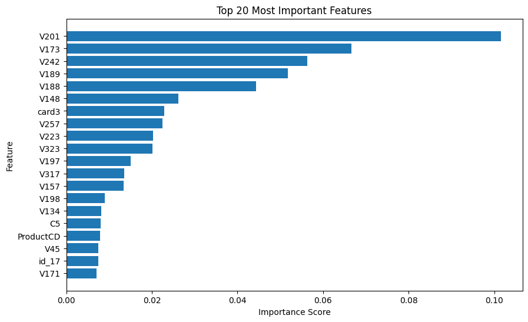
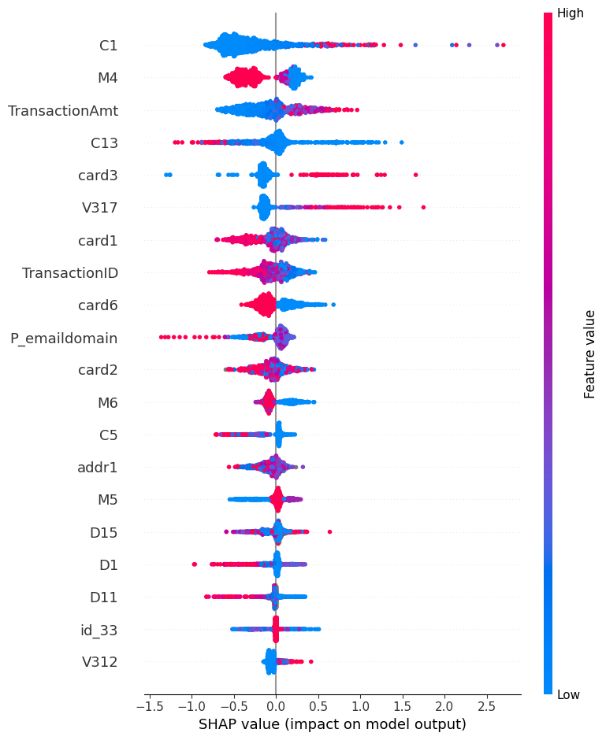
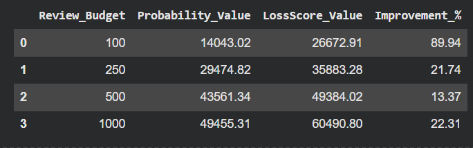

# Cost-Aware Credit Card Fraud Detection using XGBoost
> Recover up to 89.9% more fraudulent transaction value under constrained investigation budgets using a cost-aware ranking strategy.

## Project Workflow

Data Exploration
→ Missing Value Investigation
→ Feature Reduction
→ XGBoost Training
→ Threshold Optimization
→ LossScore Ranking
→ SHAP Explainability
→ Business Impact Evaluation

## Overview

Traditional fraud detection systems are typically optimized for classification metrics such as accuracy, precision, recall, and ROC-AUC. However, in real-world fraud operations, not all fraudulent transactions have the same financial impact. Missing a $5 fraudulent transaction and missing a $3,000 fraudulent transaction create very different business consequences.

This project develops an explainable and cost-aware fraud detection framework using XGBoost, SHAP, and a custom LossScore ranking strategy. The objective is not only to identify fraudulent transactions but also to prioritize investigations based on potential financial loss under limited review capacity.

---

## Business Problem

Fraud investigation teams operate with limited resources and can only review a small fraction of daily transactions.

Most machine learning fraud detection systems rank transactions solely by fraud probability. This project investigates whether combining fraud probability with transaction value can improve fraud-loss recovery without increasing analyst workload.

Key questions explored:

* How accurately can fraudulent transactions be detected?
* Which features contribute most to fraud predictions?
* How does threshold selection affect fraud detection performance?
* Can investigation resources be allocated more effectively using financial impact rather than fraud probability alone?

---

## Dataset

Dataset: IEEE-CIS Fraud Detection Dataset

* Original dataset size: ~590,000 transactions
* Working subset: 100,000 transactions
* Original features: 434
* Fraud rate: 2.56%
* Highly imbalanced binary classification problem

A representative subset of 100,000 transactions was used to accelerate experimentation while preserving the original fraud distribution.

---

## Tech Stack

* Python
* Pandas
* NumPy
* Scikit-Learn
* XGBoost
* SHAP
* Matplotlib

---

## Project Workflow

1. Data Exploration
2. Missing Value Investigation
3. Feature Reduction
4. Data Preparation
5. XGBoost Model Training
6. Threshold Optimization
7. Cost-Aware Transaction Ranking
8. SHAP Explainability Analysis
9. Business Impact Evaluation

---

## Feature Engineering & Reduction

The dataset contained a large number of redundant and highly correlated variables.

Feature reduction included:

* Constant feature analysis
* Near-constant feature analysis
* Correlation-based feature removal

### Results

| Stage            | Features |
| ---------------- | -------- |
| Original Dataset | 435      |
| Reduced Dataset  | 309      |

This reduced dimensionality by approximately 29% while preserving the majority of predictive information.

---

## Model Performance

### XGBoost (Default Threshold = 0.50)

| Metric               | Value     |
| -------------------- | --------- |
| ROC-AUC              | 0.943     |
| Precision            | 95.4%     |
| Recall               | 48.8%     |
| Fraud Cases Detected | 250 / 512 |
| False Positives      | 12        |

The model achieved strong discrimination performance but prioritized precision over fraud coverage, resulting in many fraudulent transactions remaining undetected.

---

## Threshold Optimization

Because missed fraud is typically more costly than additional investigations, thresholds were optimized using the F2 score, which places greater emphasis on recall.

### Best Threshold

* Threshold = 0.10
* F2 Score = 0.667

### Optimized Results

| Metric               | Value     |
| -------------------- | --------- |
| Precision            | 63.0%     |
| Recall               | 67.6%     |
| Fraud Cases Detected | 346 / 512 |

### Business Impact

* Recall improved from 48.8% to 67.6%
* Fraud detections increased from 250 to 346 transactions
* 96 additional fraudulent transactions were identified
* Fraud detection coverage improved by approximately 38%

---

## Cost-Aware Fraud Prioritization

Traditional fraud detection systems rank transactions using only fraud probability.

This project introduces a custom ranking metric:

LossScore = Fraud Probability × Transaction Amount

The LossScore prioritizes transactions that are both:

* Likely to be fraudulent
* Financially significant

This allows investigation teams to focus on the transactions with the highest potential financial loss.

---

## Business Impact Evaluation

A review-budget simulation was conducted to compare:

1. Fraud Probability Ranking
2. LossScore Ranking

under identical investigation budgets.

### Fraud Value Recovery Improvement

| Review Budget    | Improvement |
| ---------------- | ----------- |
| Top 100 Reviews  | +89.9%      |
| Top 250 Reviews  | +21.7%      |
| Top 500 Reviews  | +13.4%      |
| Top 1000 Reviews | +22.3%      |

### Key Finding

Under a constrained review budget of only 100 investigations, the LossScore ranking strategy recovered nearly 90% more fraudulent transaction value than ranking transactions solely by fraud probability.

These results demonstrate that incorporating financial impact into transaction prioritization can significantly improve fraud-loss recovery without increasing analyst workload.

---
## Key Visualizations

### Feature Importance



### SHAP Explainability



### Business Impact



---
## Explainability with SHAP

SHAP (SHapley Additive Explanations) was used to improve model transparency and understand the factors driving fraud predictions.

Key influential features included:

* C1
* M4
* TransactionAmt
* card3
* V317

The analysis showed that fraud predictions were driven by a combination of transaction behaviour, card attributes, identity information, and engineered features.

---

## Repository Structure

```text
cost-aware-credit-card-fraud-detection/

├── images/
├── Cost_Aware_Credit_Card_Fraud_Detection.ipynb
├── requirements.txt
├── README.md
└── LICENSE
```

---

## How to Run

Clone the repository:

```bash
git clone https://github.com/your-username/cost-aware-credit-card-fraud-detection.git
```

Install dependencies:

```bash
pip install -r requirements.txt
```

Open and run:

```bash
Cost_Aware_Credit_Card_Fraud_Detection.ipynb
```

---

## Limitations

* Evaluated on a 100,000-transaction subset rather than the full IEEE-CIS dataset
* Fraud patterns may evolve over time (concept drift)
* Transaction amount is used as a proxy for financial impact
* Threshold selection depends on business objectives and operational constraints

---

## Future Improvements

* Evaluate on the complete IEEE-CIS dataset
* Build a real-time fraud scoring API
* Add automated model monitoring and drift detection
* Develop an interactive SHAP dashboard
* Explore advanced cost-sensitive learning techniques

---

## Key Takeaway

Most fraud detection projects stop at prediction.

This project extends beyond classification by combining fraud prediction, threshold optimization, explainability, and business-driven prioritization to maximize fraud value recovery under realistic operational constraints.
